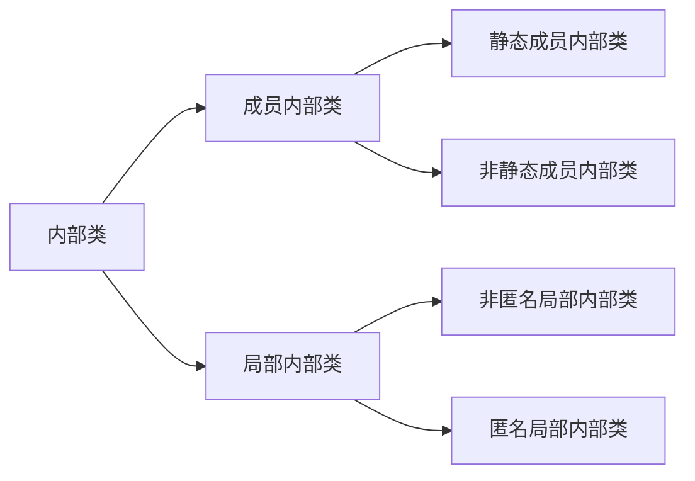

# 第08章_面向对象编程(高级)

## 1. 关键字：static

<font color="#c43c3c">**回顾类中的实例变量(即非static的成员变量)**</font>

```java
class Circle{
    private double radius;
    public Circle(double radius){
        this.radius = radius;
    }
    public double findArea(){
        return Math.PI * radius * radius;
    }
}
```

创建两个Circle对象：

```java
Circle c1 = new Circle(2.0);
Circle c2 = new Circle(3.0);
```

Circle类中的变量radius是一个实例变量(instance variable)，它属于类的每一个对象，c1中的radius变化不会影响c2的radius，反之亦然

<font color="#c43c3c">**如果想让一个成员变量被类的所有实例所共享，就用static修饰即可，称为类变量(或类属性)！**</font>

### 1.1 类属性、类方法的设计思想

当我们编写一个类时，其实就是在描述其对象的属性和行为，而并没有产生实质上的对象，只有通过new关键字才会产出对象，这时系统才会分配内存空间给对象，其方法才可以供外部调用。我们有时候希望无论是否产生了对象或无论产生了多少对象的情况下，<font color="#ff9900">某些特定的数据在内存空间里只有一份</font>。例如，所有的中国人都有个国家名称，每个中国人都共享这个国家名称，不必在每一个中国人的实例对象中都单独分配一个用于代表国家名称的变量。


此外，在类中声明的实例方法，在类的外面必须要先创建对象，才能调用。但是有些方法的调用者和当前类的对象无关，这样的方法通常被声明为<font color="#ff9900">类方法</font>，由于不需要创建对象就可以调用类方法，从而简化了方法的调用。

这里的类方法、类变量，只需要使用`static`修饰即可。所以也称为静态变量、静态方法。

### 1.2 static关键字

- 使用范围：
  - 在Java类中，可用static修饰属性、方法、代码块、内部类
- 开发使用场景：
  - 静态变量：
    1. 判断当前类的多个实例是否能共享此成员变量，且此成员变量的值是相同的
    2. 开发中，常讲一些常量声明是静态的。比如Math里的PI
  - 静态方法：
    1. 方法内操作的变量如果都是静态变量而非实例变量的话，则此方法建议声明为静态方法
    2. 开发中，常常将工具类中的方法，声明为静态方法，比如:Arrays类、Math类

### 1.3 静态变量

静态变量：类中的属性用static进行修饰

#### 1.3.1 语法格式

```java
//属性
//成员变量：类中
static 数据类型 属性名;
//局部变量：方法内、方法形参、构造期内、构造器形参、代码块内

```

#### 1.3.2 静态变量的特点

- 个数
  - 静态变量：在内存空间中只有一份，被类的多个对象共享
  - 实例变量：类的每一个实例(对象)都保存着一份实例变量
- 内存位置
  - 静态变量：jdk6之前存放在方法区；jdk7及以后，存放在堆空间
  - 实例变量：存放在堆空间的对象实体中
- 加载时机
  - 静态变量：`随着类的加载而加载`，由于类只会加载一次，所以静态变量也只有一份
  - 实例变量：随着对象的创建而加载，每个对象拥有一份实例变量
- 调用者
  - 静态变量：<font color="#c43c3c">**可以被类直接调用**</font>，也可以使用对象调用
  - 实例变量：只能使用对象进行调用
- 消亡时机：
  - 静态变量：随着类的卸载而消亡
  - 实例变量：随着对象的消亡而消亡

#### 1.3.3 举例

```java

```


#### 1.3.4 内存解析


### 1.4 静态方法

#### 1.4.1 语法格式

```java
权限修饰符 static 返回值类型 方法名(形参列表){
    方法体
}
```

#### 1.4.2 静态方法的特点

- 随着类的加载而加载
- 可以通过”`类.静态方法`“的方式，直接调用静态方法
- 静态方法内可以调用静态的属性或静态的方法(属性和方法的前缀使用的是当前类，可以省略)，不可以调用非静态的结构比如属性、方法；
- 在类的非静态方法中，可以调用当前类中的静态结构或非静态结构
- <font color="#c43c3c">**静态方法不能被重写**</font>，也不能被覆盖，不存在多态性，原因是静态方法与对象无关，跟类有关

#### 1.4.3 举例

```java
public class ChineseTest {
    public static void main(String[] args) {

        System.out.println(Chinese.nation);
        Chinese.show();

        Chinese c1 = new Chinese();
        c1.name = "姚明";
        c1.age = 40;
        c1.nation = "China";
        //Chinese.nation = "China"; 这样写最好，因为静态变量属于类，每个实例都共有

        Chinese c2 = new Chinese();
        c2.name = "刘翔";
        c2.age = 39;

        c1.show();

        test();
    }

    public static void test(){
        System.out.println("我是static的测试方法");
    }

}

class Chinese{
    //非静态变量 / 实例变量
    String name;
    int age;

    //静态变量 / 类变量
    static String nation;

    @Override
    public String toString() {
        return "Chinese{" +
                "name='" + name + '\'' +
                ", age=" + age +
                '}';
    }

    public void eat(String food){
        System.out.println("我喜欢吃" + food);
    }

    public static void show(){
        System.out.println("我是一个中国人！");

        //调用静态的结构
        System.out.println("nation:" + nation);
        method1();

        //调用非静态结构
//        System.out.println("name:" + name);
//        eat("饺子");
    }

    public static void method1(){
        System.out.println("我是静态的测试方法");
    }

    public void method2(){
        System.out.println("我是非静态的测试方法");
        System.out.println("name" + this.name);
        this.eat("饺子");
    }
}
```


## 2. 单例(Singleton)设计模式

### 2.1 设计模式概述

<font color="#c43c3c">**设计模式**</font>是在大量的`实践中总结`和`理论化`之后优选的代码结构、编程风格以及解决问题的思考方式。设计模式免去我们自己再思考和摸索。就像是典型的棋谱，不同的棋局，我们用不同的棋谱。“套路”

经典的设计模式共有23种，每个设计模式均是特定环境下特定问题的处理方法。


> 简单工厂模式并不是23种经典模式的一种，是其中工厂方法的简化版

### 2.2 何为单例模式

所谓类的单例设计模式，就是采取一定的方法保证在整个的软件系统中，对某个类<font color="#c43c3c">**只能存在一个对象实例**</font>，并且该类只提供一个取得其对象实例的方法。

### 2.3 实现思路

如果我们要让类在一个虚拟机中只能产生一个对象，我们首先必须将`类的构造器的访问权限设置为private`，这样，就不能用new操作符在类的外部产生类的对象了，但在类内部仍可以产生该类的对象。因为在类的外部开始还无法得到类的对象，`只能调用该类的某个静态方法`以返回类内部创建的对象，静态方法只能访问类中的静态成员变量，所以，指向类内部产生的`该类对象的变量也必须定义成静态的`。

### 2.4 单例模式的两种实现方式

#### 2.4.1 饿汉式

```java
//饿汉式
class Bank{
    //1. 类的构造器私有化
    private  Bank(){

    }

    //2. 在类的内部创建当前类的实例，也可以看作是这个类的一个属性，只不过属性是这个类本身
    //4. 此属性也必须声明为static
    private static Bank instance = new Bank();
    
    
    //3. 使用getXxx()方法获取当前类的实例，必须声明为static
    public static Bank getInstance(){
        //静态方法中智能调用静态结构，于是有4
        return instance;
    }
}
```

#### 2.4.2 懒汉式

```java
//懒汉式
class GirlFriend{
    //1. 类的构造器私有化
    private GirlFriend(){

    }
    //2. 声明当前类的实例
    //4. 此属性也必须声明为static
    private static GirlFriend instance = null;

    //3. 通过getXxx()方法获取当前类的实例，如果未创建对象，则在方法内部进行创建
    public static GirlFriend getInstance(){
        if (instance == null){
            instance = new GirlFriend();
        }
        return instance;
    }
}
```

#### 2.4.3 饿汉式 vs 懒汉式

饿汉式：

- 特点：`立即加载`，即在使用类的时候已经将对象创建完毕
- 优点：实现起来简单；内存中较早加载，更方便、更快；没有多`线程安全`问题
- 缺点：当类被加载的时候，会初始化static的实例，静态变量被创建并分配内存空间，从这之后，这个static的实例便一直占着这块内存，直到类被卸载时，静态变量被摧毁并释放所占有的内存。因此某些特定条件下会`耗费内存`

懒汉式：

- 特点：`延迟加载`，即在调用静态方法时实例才被创建
- 优点：当类被加载时，static的实例未被创建并分配内存空间，当静态方法第一次被调用时，初始化实例变量，并分配内存，因此在某些特定条件下会`节约内存`
- 缺点：在多线程环境中，这种实现方法是完全错误的，`线程不安全`，根本不能保证单例的唯一性
  - 说明：在多线程章节，会将懒汉式改造成线程安全的模式

### 2.5 单例模式的优点及应用场景

由于单例模式只生成一个实例，减少了`系统性能开销`，当一个对象的产生需要比较多的资源时，如读取配置、产生其他依赖对象时，则可以通过在应用启动时直接产生一个单例对象，然后永久驻留内存的方式来解决

举例：


<font color="#c43c3c">**应用场景**</font>

- Windows的Task Manager(任务管理器)就是很典型的单例模式
- Windows的Recycle Bin(回收站)也是典型的单例应用。在整个系统运行过程中，回收站一直维护着仅有的一个实例。
- Application也是单例的典型应用
- 应用程序的日志应用，一般都使用单例模式实现，这一般时由于共享的日志文件一直出于打开状态，因为只能有一个实例去操作，否则不好追加
- 数据库连接池的设计一般也是采用单例模式，因为数据库连接是一种数据库资源


## 3. 理解main方法的语法

由于JVM需要调用类的main()方法，所以该方法的访问权限必须是public，又因为JVM在执行main()方法时不必创建对象，所以该方法必须是static的，该方法接收一个String类型的数组参数，该数组中保存执行Java命令时传递给所运行的类的参数。

又因为main()方法是静态的，我们不能直接访问该类中的非静态成员，必须创建该类的一个实例对象后，才能通过这个对象去访问类中的非静态成员，这种情况我们在之前的例子中多次碰到

<font color="#c43c3c">**命令行参数用法举例**</font>

```java
public class CommandPara{
    public static void main(String[] args){
        for (int i = 0; i < args.length; i++){
            System.out.println("args[" + i + "]" + args[i]); 
        }
    }
}
```

```java
//运行程序CommandPara.java
java CommandPara "Tom" "Jerry" "Shkstart"
```

```java
//输出结果
args[0] = Tom
args[1] = Jerry
args[2] = Shkstart 
```

<font color="#c43c3c">**IDEA用法举例**</font>

```java
Run -> Edit Configurations -> 选择所在包 -> 选中要传参数的文件 -> Program arguments -> 参数中间用空格隔开
```


```java
public class MainTest {
    //看作是程序的入口，格式是固定的
    public static void main(String[] args) {      
        String[] arr = new String[]{"AA", "BB", "CC"};
        Main.main(arr);
    }
}

class Main{
    //看作是普通的静态方法
    public static void main(String[] args) {
        System.out.println("Main里面的main()方法的调用");
        for (int i = 0; i < args.length; i++) {
            System.out.println(args[i]);
        }
    }
}
```


## 4. 类的成员之四：代码块

如果成员变量想要初始化的值不是一个硬编码的常量值，而是需要通过复杂的计算或读取文件、或读取运行环境信息等方式才能获取的一些值，该怎么办呢？此时，可以考虑代码块(或初始化块)。

- 代码块的`作用`：用来初始化类或对象的信息(即初始化类或对象的成员变量)
- 代码块的修饰：只能使用static进行修饰
- 代码块的`分类`：
  - 一个类中代码块若有修饰符，则只能被static修饰，称为静态代码块
  - 没有使用static修饰的，为非静态代码块

### 4.1 静态代码块

如果想要为静态变量初始化，可以直接在静态变量的声明后面直接赋值，也可以使用静态代码块。

#### 4.1.1 语法格式

在代码块的前面加static，就是静态代码块

```java
【修饰符】 class 类名{
    static {
        静态代码块
    }
}
```

#### 4.1.2 静态代码块的特点/具体使用

1. 可以有输出语句。
2. 可以对类的属性、类的声明进行初始化操作。
3. 不可以对非静态的属性初始化。即：不可以调用非静态的属性和方法。
4. 若有多个静态的代码块，那么按照从上到下的顺序依次执行。
5. 静态代码块的执行要先于别的非静态代码块。
6. `随着类的加载而执行`。
7. 由于类的加载只会执行一次，进而静态代码块也`只会执行一次`。

#### 4.1.3 静态代码块的作用

用来初始化类的信息

内部可以执行声明变量、调用属性或方法、编写输出语句等操作

### 4.2 非静态代码块

#### 4.2.1 语法格式

```java
【修饰符】 class 类名{
    {
        代码块
    }
}
```

#### 4.2.2 非静态代码块的执行特点/具体使用

1. `随着对象的创建而执行，且先于构造器`。
2. 每创建当前类的一个实例，就会执行一次非静态代码块。
3. 内部可以声明变量、调用属性或方法、编写输出语句等操作。
4. 如果声明有多个非静态代码块，则按照声明的先后顺序执行。
5. 静态代码块内部可以调用静态的结构(即静态的属性、方法)，也可以调用非静态结构。

#### 4.2.3 非静态代码块的作用

用来初始化对象的信息

#### 4.2.4 非静态代码块的意义

### 4.3 举例

<font color="#c43c3c">**举例1：**</font>

（1）声明User类

- 包含属性：username(String类型)，password(String类型)，registerTime(long类型)，私有化
- 包含get/set方法，其中registerTime没有set方法
- 包含无参构造
  - 输出“新用户注册”
  - registerTime赋值为当前系统时间
  - username就默认为当前系统时间值
  - password就默认为“123456”
- 包含有参构造
  - 输出“新用户注册”
  - registerTime赋值为当前系统时间
  - username和password由参数赋值
- 包含public String getInfo()方法，返回：“用户名：xx， 密码：信息， 注册时间：xx”

（2）编写测试类，测试类方法main方法的代码如下：

```java
public static void main(String[] args){
    User u1 = new User();
    System.out.println(u1.getInfo());
    
    User u2 = new User("song", "8888");
    System.out.println(u2.getInfo());
}
```

如果不用非静态代码块，User类是这样的：

```java
public class User {
    private String userName;
    private String password;
    private long registrationTime;

    public String getUserName() {
        return userName;
    }

    public void setUserName(String userName) {
        this.userName = userName;
    }

    public String getPassword() {
        return password;
    }

    public void setPassword(String password) {
        this.password = password;
    }

    public long getRegistrationTime() {
        return registrationTime;
    }

    public User() {
        System.out.println("新用户注册");
        this.registrationTime = System.currentTimeMillis();   //获取系统当前时间
        this.userName = System.currentTimeMillis() + "";
        password = "123456";
    }

    public User(String userName, String password) {
        System.out.println("新用户注册");
        this.registrationTime = System.currentTimeMillis();   //获取系统当前时间
        this.userName = userName;
        this.password = password;
    }

    public String getInfo(){
        String info = "用户名：" + userName + ", 密码：" + password + ", 注册时间：" + registrationTime;
        return info;
    }
}
```

如果提取构造器公共代码到非静态代码块，User类是这样的：

```java
public class User1 {
    private String userName;
    private String password;
    private long registrationTime;

    public String getUserName() {
        return userName;
    }

    public void setUserName(String userName) {
        this.userName = userName;
    }

    public String getPassword() {
        return password;
    }

    public void setPassword(String password) {
        this.password = password;
    }

    public long getRegistrationTime() {
        return registrationTime;
    }

    {
        System.out.println("新用户注册");
        this.registrationTime = System.currentTimeMillis();   //获取系统当前时间
    }
    public User1() {

        this.userName = System.currentTimeMillis() + "";
        password = "123456";
    }

    public User1(String userName, String password) {
        this.userName = userName;
        this.password = password;
    }

    public String getInfo(){
        String info = "用户名：" + userName + ", 密码：" + password + ", 注册时间：" + registrationTime;
        return info;
    }

}
```

<font color="#c43c3c">**举例2：**</font>

```java
private static DataSource dataSource = null;

static{
    InputStream is = null;
    try{
        is = DBCPTest.class.getClassLoader().getResourceAsStream("dbcp.properties");
        Properties pros = new Properties();
        pros.load(is);
        //调用BasicDataSourceFactory的静态方法，获取数据源
        dataSource = BasicDataSourceFactory.createDataSource(pros);
    }catch (Exception e){
        e.printStackTrace();
    }finally{
        if(is != null){
            try{
                is.close();
            }catch (IOException e){
                e.printStackTrace();
            }
        }
    }
}
```


### 4.4 小结：实例变量赋值顺序


给实例变量赋值的位置很多，开发中如何选？

- 显式赋值：比较适合于每个对象的属性值相同的场景
- 构造器赋值：比较适合于每个对象的属性值不相同的场景

## 5. final关键字

### 5.1 final的意义

最终的，不能再往下延续了

### 5.2 final的使用

可修饰的结构：类、方法、变量

#### 5.2.1 final修饰类

**<font color="#c43c3c">作用：</font>**表示此类不能被继承

比如：String、StringBuffer、StringBuilder

#### 5.2.2 final修饰方法

**<font color="#c43c3c">作用：</font>**表示此方法不能被重写

比如：Object类的getClass()方法

#### 5.2.3 final修饰变量

范围：成员变量、局部变量

**<font color="#c43c3c">作用：</font>**此时“变量”就变成了“常量”，意味着一旦赋值就不可更改

- 修饰成员变量：有哪些位置可以给成员变量赋值

  - 显式赋值
  - 代码块中赋值
  - 构造器赋值

  > 注意：默认赋值这时不靠谱，必须赋值

- 修饰局部变量：一旦赋值不饿能更改

  - 方法内声明的局部变量：在调用局部变量前一定要赋值，而且一旦赋值，就不可更改
  - 方法的形参：在调用此方法时，对形参进行赋值，而且一旦赋值，就不可更改

**<font color="#c43c3c">final与static搭配：</font>**修饰成员变量时，此变量就称为`全局常量`

- 比如：Math.PI

### 5.3 笔试题

```java
//题目1：排错
public class Something{
    public int addOne(final int x){
        return ++x;        //x不能重新赋值
        //return x+1;        正确
    }
}

//题目2：排错
public class Something{
    public static void main(String[] args){
        Other o = new Other();
        new Something().addOne(o);
    }
    public void addOne(final Other o){
        o = new Other();             //o不能改变
        o.i++;                       //o内部属性可以改变
    }
}
class Other{
    public int i;
}
```


## 6. 抽象类与抽象方法(或abstract关键字)

### 6.1 由来

举例1：

随着继承层次中一个个新子类的定义，类变得越来越具体，而父类则更一般，更通用。类的设计应该保证父类和子类能够共享特征。有时将一个父类设计得非常抽象，以至于它没有具体的实例，这样的类叫做抽象类。

举例2：我们声明一些几何图形类：圆、矩阵、三角形类等，发现这些类都有共同特征：求面积、求周长。那么这些共同的特征应该抽取到一个共同父类：几何图形类中。但是这些方法在父类中又`无法给出具体的实现`，而是应该交给子类各自具体实现。那么父类在声明这些方法时，`就只有方法签名，没有方法体`，我们把没有方法体的方法称为<font color="#c43c3c">**抽象方法**</font>。Java语法规定，包含抽象方法的类必须是<font color="#c43c3c">**抽象类**</font>。

```java
//举例1：GeometricObject-Circle-Rectangle

abstract class GeometricObject{   //几何图形
    //求面积（只能考虑提供方法的声明，而没有办法提供方法体。所以，此方法适合声明为抽象方法）

    //求周长（只能考虑提供方法的声明，而没有办法提供方法体。所以，此方法适合声明为抽象方法）
}

class Circle extends GeometricObject{
    //求面积（必须重写或实现父类中的抽象方法）

    //求周长（必须重写或实现父类中的抽象方法）
}

class Rectangle extends GeometricObject{
    //求面积（必须重写或实现父类中的抽象方法）

    //求周长（必须重写或实现父类中的抽象方法）
}


//举例2：Account-SavingAccount-CheckAccount

abstract class Account{
    double balance;

    //取钱（声明为抽象方法）

    //存钱（声明为抽象方法）
}

class SavingAccount extends Account{   //储蓄卡
    //取钱（必须重写或实现父类中的抽象方法）

    //存钱（必须重写或实现父类中的抽象方法）
}

class CheckAccount extends Account{    //信用卡
    //取钱（必须重写或实现父类中的抽象方法）

    //存钱（必须重写或实现父类中的抽象方法）
}
```


### 6.2 语法格式

- <font color="#c43c3c">**抽象类：**</font>被abstract修饰的类，没有具体的实例
- <font color="#c43c3c">**抽象方法：**</font>被abstract修饰没有方法体的方法

抽象类的语法格式

```java
[权限修饰符] abstract class 类名{
    
}
[权限修饰符] abstract class 类名 extends 父类{
    
}
```

抽象方法的语法格式：

```java
[其他修饰符] abstract 返回值类型 方法名([形参列表])；
```

> 注意：抽象方法没有方法体

```java
public abstract class Animal{
    public abstract void eat();
}
```

```java
public class Cat extends Animal{
    public void eat(){
        System.out.println("小猫吃鱼和猫粮")
    }
}
```

```java
public class CatTest{
    public static void main(String[] args){
        Cat c = new Cat();
        c.eat();
    }
}
```

此时的方法重写，是子类对父类抽象方法的完成实现，我们将这种方法重写的操作，也叫做实现方法

### 6.3 使用说明

- `抽象类`

  1. 抽象类<font color="#c43c3c">**不能创建对象**</font>，如果创建，编译无法通过而报错。只能创建其非抽象子类的对象。

     > 理解：假设创建了抽象类的对象，调用抽象的方法，而抽象方法没有具体的方法体，没有意义
     >
     > 抽象类是用来被继承的，抽象类的子类必须重写父类的抽象方法，并提供方法体。若没有重写全部的抽象方法仍为抽象类

  2. 抽象类中，也有构造器，是供子类创建对象时，初始化父类成员变量使用的。

     > 理解：子类的构造方法中，有默认的super()或手动的super(实参列表)，需要访问父类构造方法。

  3. 抽象类中，不一定包含抽象方法，但是有抽象方法的类必定是抽象类

     > 理解：未包含抽象方法的抽象类，目的就是不想让调用者创建该类对象，通常用于某些特殊的类结构设计

  4. 抽象类的子类，必须重写抽象父类中<font color="#c43c3c">**所有的**</font>抽象方法，否则，编译无法通过而报错。除非该子类也是抽象类

     > 理解：假设不重写所有抽象方法，则类中可能包含抽象方法。那么创建对象后，调用抽象的方法，没有意义

- `抽象方法`
  1. 抽象方法只有方法的声明，没有方法体
  2. 抽象方法其功能是确定的(通过方法的声明即可确定)，只是不知道如何具体实现(体现为没有方法体)
  3. 子类必须重写父类中的所有的抽象方法之后，方可实例化。否则，该子类仍然是一个抽象类

### 6.4 注意事项

- 不能用abstract修饰变量、代码块、构造器

- 不能用abstract修饰私有方法、静态方法、final修饰的方法、final修饰的类

  > 私有方法不能重写
  >
  > 避免静态方法使用类进行调用
  >
  > final修饰的方法不能被重写
  >
  > final修饰的类不能被继承

### 6.5 应用举例1

在航运共公司系统中，Vehicle类需要定义两个方法分别为`计算运输工具的燃料效率`和`行驶距离`。

<font color="#c43c3c">**问题：**</font>卡车(Truck)和驳船(RiverBarge)的燃料效率和行驶距离的计算方法完全不同。Vehicle不能提供计算方法，但子类可以。

<font color="#c43c3c">**解决方案：**</font>Java允许设计者指定：超类声明一个方法但提供实现，该方法的实现由子类提供。这样的方法称为抽象方法。有一个或更多抽象方法的类称为抽象类

```java
//Vehicle是一个抽象类，有两个抽象方法
public abstract class Vehicle{
    public abstract double calcFuelEfficiency();   //计算燃料效率的抽象方法
    public abstract double calcTripDistance();     //计算行驶距离的抽象方法
}
public class Truck extends Vehicle{
    public double calcFuelEfficiency(){
        //写出卡车的计算燃料效率的具体方法
    }
    public abstract double calcTripDistance(){
        //写出计算卡车的行驶距离的具体方法
    }    
}
public class RiverBarge extends Vehicle{
    public double calcFuelEfficiency(){
        //写出计算驳船的燃料效率的具体方法
    }
    public abstract double calcTripDistance(){
        //写出计算驳船的行驶距离的具体方法
    }    
}
```


### 6.6 应用举例2：模板方法设计模式(TemplateMethod)

抽象类体现的就是一种模板模式的设计，抽象类作为多个子类的通用模板，子类在抽象类的基础上进行扩展、改造，但子类总体上会保留抽象类的行为方式。

<font color="#c43c3c">**解决的问题：**</font>

- 当功能内部一部分实现是确定的，另一部分实现是不确定的，这时可以把不确定的部分暴露出去，让子类去实现
- 换句话说，在软件开发中实现一个算法时，整体步骤很固定、通用，这些步骤已经在父类中写好了。但是某些部分易变，易变的部分可以抽象出来，供不同子类实现。这就是一种模板模式

<font color="#c43c3c">**类比举例：**</font>六级作文模板、制造月饼的模板

```java
public class TemplateMethodTest {
    public static void main(String[] args) {
        BankTemplateMethod btm = new DrawMoney();
        btm.process();
        System.out.println();

        BankTemplateMethod btm2 = new ManageMoney();
        btm2.process();
    }
}

abstract class BankTemplateMethod{
    //具体方法
    public void takeNumber(){
        System.out.println("排队取号");
    }

    public abstract void transact();    //办理具体的业务

    public void evaluate(){
        System.out.println("反馈评分");
    }

    //模板方法，把基本操作组合到一起，子类一般不能重写
    public final void process(){
        this.takeNumber();
        this.transact();  //像个钩子，具体执行时，挂哪个子类，就执行哪个子类的实现代码
        this.evaluate();
    }
}

class DrawMoney extends BankTemplateMethod{
    @Override
    public void transact() {
        System.out.println("我要取款");
    }
}

class ManageMoney extends BankTemplateMethod{
    @Override
    public void transact() {
        System.out.println("我要理财");
    }
}
```


### 6.7 思考与练习


## 7. 接口(interface)

### 7.1 类比

生活中大家每天都在用USB接口，那么USB接口与我们今天要学习的接口有什么相同点呢？

> USB(Universal Serial Bus，通用串行总线)是Intel公司开发的总线架构，使得在计算机上添加串行设备(鼠标、键盘、打印机、扫描仪、摄像头、充电器、MP3机、手机、数码相机、移动硬盘等)非常容易

其实不管是电脑上的USB插口，还是其他设备上的USB插口都只是`遵循了USB规范`的一种具体设备而已。

只要遵循USB规范的，那么就可以与电脑互联，并正常通信。至于这个设备、电脑是哪个厂家制造的，内部是如何实现的，我们都无需关心。

Java的软件系统会由很多模块组成，那么各模块之间也应该采用这个`面向接口`的`低耦合`，为系统提供更好的可拓展性和可维护性。

### 7.2 概述

接口就是规范，定义的一组规则，体现了现实世界中“如果你是/要...则必须能”的思想。继承是一个“是不是”的is-a关系，而接口实现的则是“能不能”的`has-a`关系。

- 例如：电脑都预留了可以插入USB设备的USB接口，USB接口具备基本的数据传输的开启功能和关闭功能。你能不能用USB进行连接，或是否具备USB通信功能，就看你能否遵循USB接口规范
- 例如：Java程序是否能够连接使用某种数据库产品，那么要看该数据库产品能否实现Java设计的JDBC规范
- 

> 接口的本质是契约、标准、规范，就像我们的法律一样。制定好后大家都要遵守

### 7.3 定义格式

接口的定义，它与定义类的方式相似，但是使用`interface`关键字。它也会被编译成.class文件，但一定要明确它并不是类，而是另外一种引用数据类型。

> 引用数据类型：数组、类、枚举、接口、注释

#### 7.3.1 接口的声明格式

```java
[修饰符] interface 接口名{
    //接口的成员列表：
    // 公共的静态常量
    // 公共的抽象方法
    
    // 公共的默认方法
    // 公共的静态方法
    // 私有方法
}
```

示例代码：

```java
public interface USB3{
    //静态常量
    long MAX_SPEED = 500*1024*1024;     //500MB/s
    
    //抽象方法
    void in();
    void out();
    
    //默认方法
    default void start(){
        System.out.println("开始");
    }
    default void end(){
        System.out.println("结束");
    }
    
    //静态方法
    static void show(){
        System.out.println("USB 3.0可以同步全速地进行读写操作")
    }
}
```

#### 7.3.2 接口的成员说明

<font color="#c43c3c">**在JDK8.0之前**</font>，接口中只允许：

（1）公共的静态的常量：其中`public static final`可以省略

（2）公共的抽象的方法：其中`public abstract`可以省略

> 理解：接口是从多个相似类中抽象出来的规范，不需要提供具体实现

<font color="#c43c3c">**在JDK8.0时**</font>，接口中允许声明`默认方法`和`静态方法`：

（3）公共的默认的方法：其中public可以省略，建议保留，但是default不能省略

（4）公共的静态的方法：其中public可以省略，建议保留，但是static不能省略

<font color="#c43c3c">**在JDK9.0时**</font>，接口又增加了：

（5）私有方法

除此之外，接口中没有构造器，没有初始化块，因为接口中没有成员变量需要动态初始化

不可以声明：构造器、代码块等

### 7.4 接口的使用规则

<font color="#c43c3c">**1、类实现接口(implements)**</font>

接口<font color="#c43c3c">**不能创建对象**</font>，但可以被类实现(`implements`，类似于被继承)

类与接口的关系为实现关系，即类实现接口，该类可以称为接口的实现类。实现的动作类似继承，格式相仿，只是关键字不同，实现使用implements关键字

```java
【修饰符】 class 实现类 implements 接口1, 接口2{
    //重写接口中的抽象方法【必须】，当然如果实现类是抽象类，那么可以不写
    //重写接口中的默认方法【可选】
}

【修饰符】 class 实现类 extends 父类 implements 接口{
    //重写接口中的抽象方法【必须】，当然如果实现类是抽象类，那么可以不写
    //重写接口中的默认方法【可选】
}
```


**<font color="#c43c3c">注意：</font>**

1. 如果接口的实现类是非抽象类，那么必须`重写接口中所有抽象方法`

2. 默认方法可以选择保留，也可以重写

   > 重写时，default关键字就不要再写了，它只用于接口中表示默认方法，到类中就没有默认方法的概念了

3. 接口中的<font color="#c43c3c">静态方法</font>不能被继承也不能被重写，<font color="#c43c3c">**只能被接口本身调用**</font>，不能使用其实现类来调用

4. <font color="#c43c3c">**接口冲突：**</font>类实现了两个接口，而两个接口中定义类同名同参数的默认方法，则实现类在没有重写此两个接口默认方法的情况下，会报错。因此，要求此时实现类必须要重写接口中定义的同名同参数的方法

5. <font color="#c43c3c">**类优先原则：**</font>子类(实现类)继承了父类并是心啊类接口，父类和接口中声明了同名同参数的方法(其中接口中的是默认方法)，默认情况下，子类在没有重写此方法的情况下调用的是父类中的方法。

6. 实现类中通过`接口名.super.方法名`调用实现的接口中的默认方法

7. 接口中的私有方法是供接口中的其他方法调用的。可以把其他方法中共有的部分提取出来简化代码。

举例：

```java
interface USB{
    public void start();
    public void stop();
}
class Computer{
    public static void show(USB usb){
        usb.start();
        System.out.println("============== USB 设备工作 ===============");
        usb.stop();
    }
}
class Flash implements USB{
    public void start(){    //重写方法
       	System.out.println("U盘开始工作");
    }
    public void stop(){
        System.out.println("U盘停止工作");
    }
}
class Print implements USB{
    public void start(){    //重写方法
       	System.out.println("打印机开始工作");
    }
    public void stop(){
        System.out.println("打印机停止工作");
    }
}
public class InterfaceDemo{
    public static void main(String[] args){
        Computer.show(new Flash());
        Computer.show(new Print());
        
        c.show(new USB()){
            public void start(){
                System.out.println("移动硬盘开始运行");
            }
            public void stop(){
                System.out.println("移动硬盘停止运行");
            }
        }
    }
}
```

<font color="#c43c3c">**2、接口的多实现(implements)**</font>

之前学过，在继承体系中，一个类只能继承一个父类。而对于接口而言，一个类是可以实现多个接口的，这叫做接口的`多实现`，弥补了类的单继承的局限性。并且，一个类能继承一个父类，同时实现多个接口。

实现格式：

```java
【修饰符】 class 实现类 implements 接口1,接口2,接口3...{
    //重写接口中的抽象方法【必须】，当然如果实现类是抽象类，那么可以不写
    //重写接口中的默认方法【可选】    
}

【修饰符】 class 实现类 extends 父类 implements 接口1,接口2,接口3...{
    //重写接口中的抽象方法【必须】，当然如果实现类是抽象类，那么可以不写
    //重写接口中的默认方法【可选】    
}
```

> 接口中，有多个抽象方法时，实现类必须重写所有的抽象方法。<font color="#c43c3c">**如果抽象方法有重名的，只需要重写一次。**</font>

举例：


### 7.7 接口与抽象类之间的对比

| No.  | 区别点       | 抽象类                                                       | 接口                                   |
| ---- | ------------ | ------------------------------------------------------------ | -------------------------------------- |
| 1    | 定义         | 可以包含抽象方法的类                                         | 主要是抽象方法和全局常量的集合         |
| 2    | 组成         | 构造器、抽象方法、普通方法、常量、变量                       | 常量、抽象方法(默认方法、静态方法)     |
| 3    | 使用         | 子类继承抽象类(extends)                                      | 子类实现接口(implements)               |
| 4    | 关系         | 抽象类可以实现多个接口                                       | 接口不能继承抽象类，但允许继承多个接口 |
| 5    | 常见设计模式 | 模板方法                                                     | 简单工厂、工厂方法、代理模式           |
| 6    | 对象         | 都通过对象的多态性产生实例化对象                             |                                        |
| 7    | 局限         | 抽象类有单继承的局限                                         | 接口没有此局限                         |
| 8    | 实际         | 作为一个模板                                                 | 是作为一个标准或是一种能力             |
| 9    | 选择         | 如果抽象类和接口都可以使用的话，优先使用接口，因为避免单继承的局限 |                                        |

> 在开发中，常看到一个类不是去继承一个已经实现好的类，而是要么继承抽象类，要么实现接口


## 8. 内部类(InnerClass)：类的成员之五

### 8.1 概述

#### 8.1.1 什么是内部类

将一个类A定义在另一个类B里面，里面的那个类A就称为`内部类(InnerClass)`，则类B就称为`外部类(OuterClass)`

#### 8.1.2 为什么要声明内部类呢

具体来说，当一个事物A的内部，还有一个部分需要一个完整的结构B进行描述，而这个内部的完整的`结构B又只为外部事物A提供服务`，不在其他地方单独使用，那么整个内部的完整结构B最好使用内部类。

总的来说，遵循`高内聚、低耦合`的面向对象开发原则

#### 8.1.3 内部类的分类

根据内部类声明的位置(如同变量的分类)，我们可以分为：



### 8.2 成员内部类

#### 8.2.1 概述

成员内部类：直接声明在外部类的里面

- 使用static修饰的：静态的成员内部类
- 不使用static修饰的：非静态的成员内部类

从类的角度看：

- 内部可以声明属性、方法、构造器、代码块、内部类等结构
- 此内部类可以声明父类，可以实现接口
- 可以使用final修饰，表示不能有子类
- 可以使用abstract修饰

从外部类的成员的角度看：

- 在内部可以调用外部类的结构。比如：属性、方法等。
- 除了使用public、缺省权限修饰之外，还可以使用private、protected修饰
- 可以使用static修饰

#### 8.2.2 创建成员内部类对象

- 静态的：`外部类.成员内部类 变量名 = new 外部类.成员内部类()`

- 非静态的：首先创建外部类的对象`外部类 变量名1 = new 外部类();`

  ​					然后通过对象再创建`外部类.成员内部类 变量名2 = 变量名1.new 成员内部类()`

```java
public class OuterClass {
    public static void main(String[] args) {
        //1. 创建Person的静态的成员内部类的实例
        Person.Dog dog = new Person.Dog();
        dog.eat();

        //2. 创建Person的非静态的成员内部类的实例
//        Person.Bird bird = new Person.Bird();       //报错
        Person p1 = new Person();
        Person.Bird bird = p1.new Bird();
        bird.eat();
        bird.show("黄鹂");
        bird.show1();
    }
}
```


#### 8.2.3 如何在成员内部类中调用外部类的结构

- 调用外部类的成员变量：

  仅仅用属性调用时，遵循就近原则(形参、内部类属性、外部类属性谁近就调用的谁)

  当用`this.属性名`调用时，表示调用内部类的属性

  当用`外部类.this.属性名`调用时，表示调用外部类的属性

  ```java
  public class OuterClass {
      public static void main(String[] args) {
  
          Person p1 = new Person();
          Person.Bird bird = p1.new Bird();
          bird.show("黄鹂");   //1；黄鹂；啄木鸟；Tom
      }
  }
  
  class Person{    //外部类
      String name = "Tom";
      int age = 1;
  
      public void eat(){
          System.out.println("人吃饭");
      }
  
      //非静态的成员内部类
      class Bird{
          String name = "啄木鸟";
       
          public void show(String name){
              System.out.println("age = " + age);        //省略了Person.this
              System.out.println("name = " + name);
              System.out.println("name = " + this.name);
              System.out.println("name = " + Person.this.name);
          }
      }
  }
  
  ```

- 调用外部类的方法：

  `(this.)方法()`括号内可省略，表示调用内部类自己的方法

  `外部类.this.方法()`表示调用外部类的方法

  ```java
  public class OuterClass {
      public static void main(String[] args) {
          Person p1 = new Person();
          Person.Bird bird = p1.new Bird();
          bird.eat();
          bird.show1();
      }
  }
  
  class Person{    //外部类
      String name = "Tom";
      int age = 1;
  
      public void eat(){
          System.out.println("人吃饭");
      }
  
      //非静态的成员内部类
      class Bird{
          String name = "啄木鸟";
          
          public void eat(){
              System.out.println("鸟吃虫子");
          }
          
          public void show1(){
              eat();
              this.eat();
              Person.this.eat();
          }
      }
  }
  
  ```

  

### 8.3 局部内部类

局部内部类：声明在方法内、构造器内、代码块内的内部类(`出了{}就失效了`)

- 匿名的局部内部类
- 非匿名的局部内部类

#### 8.3.1 创建局部内部类对象

- 非匿名局部内部类

  ```java
  public class OuterClassTest1 {
      //说明：局部内部类的使用
      public void method1(){
          //局部内部类
          class A{
              //可以声明属性、方法等
          }
      }
      //开发中的场景(更常使用)
      public Comparable getInstance(){
          //提供了实现了Comparable接口的类
          //方式1：提供了接口的实现类的匿名对象
          class MyComparable implements Comparable {
              @Override
              public int compareTo(Object o) {
                  return 0;
              }
          }
          return new MyComparable();        
      }
  }
  ```

- 匿名局部内部类

  ```java
  public class OuterClassTest1 {
      //说明：局部内部类的使用
      public void method1(){
          //局部内部类
          class A{
              //可以声明属性、方法等
          }
      }
      //开发中的场景(更常使用)
      public Comparable getInstance(){
          //提供了实现了Comparable接口的类
          //方式3：提供了接口的匿名实现类的匿名对象
          return new Comparable(){
              @Override
              public int compareTo(Object o) {
                  return 0;
              }
          };     
      }
  }
  ```

```java
public class OuterClassTest2 {
    public static void main(String[] args) {
        SubA a = new SubA();
        a.method();

        //举例1：提供了接口匿名实现类的对象
        A a1 = new A(){
            public void method(){
                System.out.println("匿名实现类重写的方法");
            }
        };
        a1.method();

        //举例2：提供了接口匿名实现类的匿名对象
        new A(){
            @Override
            public void method() {
                System.out.println("匿名实现类重写的方法");
            }
        }.method();

        //举例3：
        SubB s1 = new SubB();
        s1.method1();

        //举例4：提供了继承于抽象类的匿名子类的对象
        B b = new B(){
            @Override
            public void method1() {
                System.out.println("继承于抽象类的子类调用的方法");
            }
        };
        b.method1();
        System.out.println(b.getClass());
        System.out.println(b.getClass().getSuperclass());

        //举例5：提供了继承于抽象类的匿名子类的匿名对象
        new B(){
            @Override
            public void method1() {
                System.out.println("继承于抽象类的子类调用的方法");
            }
        }.method1();

        //举例6：
        C c = new C();
        c.method2();

        //举例7：提供了一个继承于C的匿名子类的对象
        C c1 = new C(){};
        c1.method2();
        System.out.println(c1.getClass());
        System.out.println(c1.getClass().getSuperclass());

        C c2 = new C(){
            @Override
            public void method2() {
                System.out.println("SubC");
            }
        };
        c2.method2();
    }
}

interface  A{
    public void method();
}

class SubA implements A{
    @Override
    public void method() {
        System.out.println("SubA");
    }
}

abstract class B{
    public abstract void method1();
}

class SubB extends B{
    @Override
    public void method1() {
        System.out.println("SubB");
    }
}

class C{
    public void method2(){
        System.out.println("C");
    }
}
```


## 9. 枚举类

### 9.1 概述

- 枚举类型本质上也是一种类，只不过这个类的对象是有限的、固定的几个，不能让用户随意创建
- 枚举类的例子：
  - `星期`
  - `性别`
  - `月份`
  - `季节`
  - `三原色`
  - `支付方式`：Cash、WeChatPay、Alipay、BankCard、CreditCard
  - `就职状态`：Busy、Free、Vocation、Dismission
  - `订单状态`：Nonpayment、Paid、Fulfilled、Delivered、Checked、Return、Exchange、Cancel
  - `线程状态`：创建、就绪、运行、阻塞、死亡
- **<font color="#c43c3c">若枚举只有一个对象，则可以作为一种单例模式的实现方式</font>**
- 枚举类的实现：
  - 在jdk5.0之前，需要程序员自定义枚举类型。
  - 在jdk5.0之后，Java支持`enum`关键字来快速定义枚举类型

### 9.2 定义枚举类(jdk5.0之前)

在jdk5.0之前如何声明枚举类呢？

- `私有化`类的构造器，保证不能在类的外部创建其对象
- 在类的内部创建枚举类的实例。声明为：`public static final`，对外暴露这些常量对象
- 对象如果有`实例变量`，建议声明为`private final`，并在构造器中初始化

示例代码：

```java
class Season{
    //2. 声明当前类的对象的实例变量，使用private final修饰，只能获取不能修改
    private final String SEASONNAME;
    private final String SEASONDESC; 
    
    //1. 私有化类的构造器
    private Season(String seasonName, String seasonDesc){
        this.SEASONNAME = seasonName;
        this.SEASONDESC = seasonDesc;
    }
    
    //3. 提供实例变量的get方法(只有get没有set，已经final了)
    public String getSEASONNAME() {
        return SEASONNAME;
    }
    public String getSEASONDESC() {
        return SEASONDESC;
    }
    
    //4. 创建当前类的实例，使用public static final修饰(暴露给外部使用且无法修改)
    public static final Season SPRING = new Season("春天", "春暖花开");
    public static final Season SUMMMER = new Season("夏天", "夏日炎炎");
    public static final Season AUTUMN = new Season("秋天", "秋高气爽");
    public static final Season WINTER = new Season("冬天", "白雪皑皑");
    
    @Override
    public String toString() {
        return "Season{" +
                "SEASONNAME='" + SEASONNAME + '\'' +
                ", SEASONDESC='" + SEASONDESC + '\'' +
                '}';
    }
}
```

### 9.3 定义枚举类(jdk5.0之后)

#### 9.3.1 enum关键字声明枚举

```java
enum Season1{
    //1. 必须在枚举类的开头声明多个对象。对象之间使用,隔开
    SPRING("春天", "春暖花开"),
    SUMMER("夏天", "夏日炎炎"),
    AUTUMN("秋天", "秋高气爽"),
    WINTER("冬天", "白雪皑皑");

    //2. 声明当前类的对象的实例变量，使用private final修饰
    private final String SEASONNAME;
    private final String SEASONDESC;

    //3. 私有化类的构造器
    private Season1(String seasonname, String seasondesc){
        this.SEASONNAME = seasonname;
        this.SEASONDESC = seasondesc;
    }

    //4. 提供实例变量的get方法
    public String getSEASONNAME() {
        return SEASONNAME;
    }

    public String getSEASONDESC() {
        return SEASONDESC;
    }
}
```

#### 9.3.2 enum方式定义的要求和特点

- 使用enum关键字定义的枚举类，默认其父类是java.lang.Enum类，不要再显式地定义其父类，否则报错
- 必须在枚举类的开头声明多个对象。对象之间使用,隔开。格式为`对象名(属性值1,属性值2,...)`
- 声明当前类的对象的实例变量，使用private final修饰
- 私有化类的构造器
- 提供实例变量的get方法

### 9.4 enum中常用方法

`String toString()`：默认返回的是常量名(对象名)，可以继续手动重写该方法

(关注)`static 枚举类型[] values()`：返回枚举类型的对象数组。该方法可以很方便地遍历所有的枚举值，是一个静态方法

(关注)`staitc 枚举类型 valueOf(String name)`：可以把一个字符串转为对应的枚举类对象。要求字符串必须是枚举类对象的"名字"。如不是，会有运行异常：IllegalArgumentException

`String name()`：得到当前枚举常量的名称，建议优先使用toString()

`int ordinal()`：返回当前枚举常量的次序号，默认从0开始

```java
public class SeasonTest1 {
    public static void main(String[] args) {
        System.out.println(Season1.SPRING.getClass());    //Season1
        System.out.println(Season1.SPRING.getClass().getSuperclass());    //Enum
        System.out.println(Season1.SPRING.getClass().getSuperclass().getSuperclass());   //Object

        //测试方法
        //1. toString()  重写前默认返回对象名
        System.out.println(Season1.SPRING);

        //2. name()  返回对象名
        System.out.println(Season1.SUMMER.name());

        //3. values()  返回枚举类的所有对象的数组
        Season1[] values = Season1.values();
        for (int i = 0; i < values.length; i++) {
            System.out.println(values[i]);
        }

        //4. valuesOf(String objName):返回当前枚举类中名称为objName的枚举类对象
        //如果枚举类中不存在objName名称的对象，则报错
        String objName = "WINTER";
//        objName = "WINTER1";
        Season1 season1 = Season1.valueOf(objName);
        System.out.println(season1);

        //5. ordinal()  返回当前枚举常量的次序号，默认从0开始
        System.out.println(Season1.AUTUMN.ordinal());

        //通过枚举类的对象调用重写接口中的方法
        Season1.SUMMER.show();
    }
}
```

### 9.5 枚举类实现接口的操作

- 情况1：枚举类实现接口，在枚举类中重写接口中的抽象方法，当通过不同的枚举类对象调用此方法时，执行的是同一个方法

  ```java
  public class SeasonTest1 {
      public static void main(String[] args) {
          //通过枚举类的对象调用重写接口中的方法
          Season1.SUMMER.show();
      }
  }
  
  interface Info{
      void show();
  }
  
  //jdk5.0中使用enum关键字来定义枚举类
  enum Season1 implements Info{
      //1. 必须在枚举类的开头声明多个对象。对象之间使用,隔开
      SPRING("春天", "春暖花开"),
      SUMMER("夏天", "夏日炎炎"),
      AUTUMN("秋天", "秋高气爽"),
      WINTER("冬天", "白雪皑皑");
  
      //2. 声明当前类的对象的实例变量，使用private final修饰
      private final String SEASONNAME;
      private final String SEASONDESC;
  
      //3. 私有化类的构造器
      private Season1(String seasonname, String seasondesc){
          this.SEASONNAME = seasonname;
          this.SEASONDESC = seasondesc;
      }
  
      //4. 提供实例变量的get方法
      public String getSEASONNAME() {
          return SEASONNAME;
      }
  
      public String getSEASONDESC() {
          return SEASONDESC;
      }
  
      @Override
      public String toString() {
          return "Season1{" +
                  "SEASONNAME='" + SEASONNAME + '\'' +
                  ", SEASONDESC='" + SEASONDESC + '\'' +
                  '}';
      }
  
      @Override
      public void show() {
          System.out.println("这是一个季节");
      }
  }
  
  ```

- 情况2：让枚举类的每一个对象重写接口中的抽象方法，当通过不同的枚举类对象调用此方法时，执行的是不同方法

  ```java
  public class SeasonTest2 {
      public static void main(String[] args) {
  
          Season2[] values = Season2.values();
          for (int i = 0; i < values.length; i++) {
              values[i].show();
          }
      }
  }
  
  interface Info1{
      void show();
  }
  
  //jdk5.0中使用enum关键字来定义枚举类
  enum Season2 implements Info1{
      SPRING("春天", "春暖花开"){
          @Override
          public void show() {
              System.out.println("这是春天");
          }
      },
      SUMMER("夏天", "夏日炎炎"){
          @Override
          public void show() {
              System.out.println("这是夏天");
          }
      },
      AUTUMN("秋天", "秋高气爽"){
          @Override
          public void show() {
              System.out.println("这是秋天");
          }
      },
      WINTER("冬天", "白雪皑皑"){
          @Override
          public void show() {
              System.out.println("这是冬天");
          }
      };
      
      //2. 声明当前类的对象的实例变量，使用private final修饰
      private final String SEASONNAME;
      private final String SEASONDESC;
      //3. 私有化类的构造器
      private Season2(String seasonname, String seasondesc){
          this.SEASONNAME = seasonname;
          this.SEASONDESC = seasondesc;
      }
      //4. 提供实例变量的get方法
      public String getSEASONNAME() {
          return SEASONNAME;
      }
      public String getSEASONDESC() {
          return SEASONDESC;
      }
      @Override
      public String toString() {
          return "Season2{" +
                  "SEASONNAME='" + SEASONNAME + '\'' +
                  ", SEASONDESC='" + SEASONDESC + '\'' +
                  '}';
      }
  }
  ```

## 10. 注解(annotation)

### 10.1 注解概述

#### 10.1.1 什么是注解

注解(annotation)是从`JDK5.0`开始引入，以”`@注解名`“在代码中存在。例如：

```java
@Override
@Deprecated
@SuppressWarnings(value="unchecked")
```

Annotation可以像修饰符一样被使用，可用于修饰包、类、构造器、方法、成员变量、参数、局部变量的声明。还可以添加一些参数值，这些信息被保存在Annotation的"name=value"对中

注解可以在类编译、运行时进行加载，体现不同的功能

#### 10.1.2 注解与注释

注解也可以看作是一种注释，通过使用Annotation，程序员可以在不改变原有逻辑的情况下，在源文件中嵌入一些补充信息。但是，注解，不同于单行注释和多行注释

- 对于单行注释和多行注释是个给程序员看的
- 而注解是可以被编译器或其他程序读取的。程序还可以根据注解的不同，做出相应的处理

#### 10.1.3 注解的重要性

在JavaSE中，注解的使用目的比较简单，例如标记过时的功能，忽略警告等。在`JavaEE/Android中注解占据了更重要的角色`，例如用来配置应用程序的任何切面，代替JavaEE旧版中遗留的`冗杂代码`和`XML配置`等。

未来的开发模式都是基于注解的，JPA是基于注解的，Spring2.5以上都是基于注解的，Hibernate3.x以后也是基于注解的，Struts2有一部分也是基于注解的了。`注解是一种趋势`，一定程度上可以说：`框架 = 注解 + 反射 + 设计模式`

### 10.2 常见的Annotation作用

**<font color="#c43c3c">示例1：生成文档相关的注解</font>**

```
@author 标明开发该类模块的作者，多个作者之间使用,分隔
@version 标明该类模块的版本
@see 参考转向，也就是相关主题
@since 从哪个版本开始增加的
@param 对方法中某参数的说明，如果没有参数就不能写
@return 对方法返回值的说明，如果方法的返回值类型是void就不能写
@exception 对方法可能抛出的异常进行说明，如果方法没有用throws显式抛出的异常就不用写    
```

**<font color="#c43c3c">示例2：在编译时进行格式检查(JDK内置的三<个基本注解)</font>**

`@override`：限定重写父类方法，该注解只能用于方法

`@Deprecated`：用于表示所修饰的元素(类，方法等)已过时。通常是因为所修饰的结构危险或存在更好的选择

`@SuppressWarnings`：抑制编译器警告

```java
public class AnnotationTest{
    @SuppressWarnings("unused")
    int a = 10;
}
```

**<font color="#c43c3c">示例3：跟踪代码依赖性，实现替代配置文件功能</font>**

- Servlet3.0提供了注解，使得不再需要在web.xml文件中进行Servlet的部署

```java

```

- Spring框架中关于”事务“的管理

```java

```

### 10.3 三个最基本的注解

#### 10.3.1 @override

- 用于检测被标记的方法为有效的重写方法，如果不是，则报编译错误
- 只能标记在方法上
- 它会被编译器程序读取

#### 10.3.2 @Deprecated

#### 10.3.3 @SupressWarnings

### 10.4 元注解

JDK5.0在java.lang.annotation包定义了4个标准的meta-annotation类型，它们被用来提供对其他annotation类型作说明

（1）<font color="#c43c3c">**@Target**</font>：用于描述注解的使用范围

- 可以通过枚举类型ElementType的10个常量对象来指定
- TYPE, METHOD, CONSTRUCTOR, PACKAGE...

（2）<font color="#c43c3c">**@Retention**</font>：用于描述注解的生命周期

- 可以通过枚举类型RetentionPolicy的3个常量对象来指定
- SOURCE(源代码)、CLASS(字节码)、RUNTIME(运行时)
- `唯一RUNTIME阶段才能被反射读取到`

（3）<font color="#c43c3c">**@Documented**</font>：表明这个注解应该被javadoc工具记录

（4）<font color="#c43c3c">**@Inherited**</font>：允许子类继承父类中的注解

> 拓展：元数据
>
> String name = "Tom";
>
> 值是最核心的
>
> 前两个都可以理解为修饰这个值的结构，一个指定类型，一个指定名称
>
> String和name就可以看作是“Tom”这个数据的元数据

### 10.5 自定义注解的使用

一个完整的注解应该包含三个部分：

（1）声明

#### 10.5.1 声明自定义注解

#### 10.5.2 使用自定义注解

#### 10.5.3 读取和处理自定义注解


### 10.6 JUnit单元测试

#### 10.6.1 测试分类

<font color="#c43c3c">**黑盒测试**</font>：不需要写代码，给输入值，看程序是否能输出期望的值

<font color="#c43c3c">**白盒测试**</font>：需要写代码，关注程序具体的执行流程

#### 10.6.2 JUnit单元测试介绍

JUnit是由 Erich Gamma 和 Kent Beck 编写的一个测试框架(regression testing framework)，供Java开发人员编写单元测试之用。

<font color="#c43c3c">**JUnit测试是程序员测试，即所谓白盒测试，因为程序员指导被测试的软件如何完成功能和完成什么样的功能。**</font>

要使用JUnit，必须在项目的编译路径中引入`JUnit的库`，即相关的.class文件组成的jar包。jar就是一个压缩包，压缩包都是开发好的第三方(Oracle公司第一方，我们自己第二方，其他都是第三方)工具类，都是以class文件形式存在的

#### 10.6.3 引入本地JUnit.jar

第一步：在项目中File-Project Structure 中操作：添加Libraries库


#### 10.6.4 编写和运行@Test单元测试方法

JUnit4版本，要求@Test标记的方法必须满足如下条件：

- 所在的类必须是public的，非抽象的，包含唯一的无参构造器
- @Test标记的方法本身必须是public，非抽象的，非静态的，void无返回值，()无参数的

#### 10.6.5 设置执行JUnit用例时支持控制台输入


#### 10.6.6 定义test测试方法模板


## 11. 包装类

### 11.1 为什么需要包装类

为了使得基本数据类型的变量`具备引用数据类型变量的相关特征`(比如：封装性、继承性、多态性)，我们给各个基本数据类型的变量都提供了对应的包装类

Java提供了两个类型系统，`基本数据类型`和`引用数据类型`。使用基本数据类型在于效率，然而当要使用只针对对象设计的API或新特性(例如泛型)，怎么办呢？例如：

```java
//情况1：方法形参
Object类的equals(Object obj)
    
//情况2：方法形参
ArrayList类的add(Object obj)
//没有如下的方法：
add(int number)
add(double d)
add(boolean b)
    
//情况3：泛型
Set<T>
List<T>
Collection<T>
Map<K, V>
```

### 11.2 有哪些包装类

Java针对八种基本数据类型定义了相应的引用类型：包装类(封装类)。有了类的特点，就可以调用类中的方法，Java才是真正的面向对象


封装以后的内存结构对比：

```java
public static void main(String[] args){
    int num = 520;
    Integer obj = new Integer(520);
}
```


### 11.3 自定义包装类

```java
public class MyInteger{
    int value;
    
    public MyInteger(){
        
    }
    
    public MyInteger(int value){
        this.value = value;
    }
    
    @override
    public String toString(){
        return String.valueOf(value);
    }
}
```

### 11.4 包装类与基本数据类型间的转换

为什么：

- 一方面，在有些场景下，需要使用基本数据类型对应的包装类的对象，此时就需要将基本数据类型的变量转换为包装类的对象。比如：ArrayList类的add(Object obj)；Object类的equals(Object obj)
- 对于包装类来讲，既然我们使用的是对象，那么对象是不能进行+ - * / 等运算的。为了能够进行这些运算，就需要将包装类的对象转换为基本数据类型的变量。

#### 11.4.1 装箱

装箱：把基本数据类型转为包装类对象

> 转为包装类的对象，是为了使用专门为对象设计的API和特性

基本数值 ----> 包装对象

```java
Boolean bb1 = Boolean.valueOf(true);

int i2 = 10;
Integer ii2 = Integer.valueOf(i2);

```

#### 11.4.2 拆箱

拆箱：把包装类对象拆为基本数据类型

> 转为基本数据类型，一般是因为运算需要，Java中的大多数运算符是为基本数据类型设计的。比较、算术等

包装对象 ----> 基本数值

```java
Integer ii1 = new Integer(10);
int i1 = ii1.intValue();
i1++;
System.out.println(i1);

Float ff1 = new Float(12.3f);
float f1 = ff1.floatValue();
        

boolean b1 = bb1.booleanValue();
```

自动装箱与拆箱：

由于我们经常要做基本类型与包装类之间的转换，从JDK5.0开始，基本类型与包装类的装箱、拆箱动作可以自动完成。例如：

```java
//自动装箱
int i1 = 10;
Integer ii1 = i1;
System.out.println(ii1.toString());
Integer ii2 = i1 + 1;
System.out.println(ii2.toString());
Boolean bb1 = true;
Float f1 = 12.3f;
String s1 = "32.1";
Float ff2 = new Float(s1);
//        String s2 = "abc";
//        Float ff3 = new Float(s2);     //报异常


//自动拆箱
int i2 = ii1;
boolean b1 = bb1;
```

> 注意：只能与自己对应的类型之间才能实现自动装箱与拆箱

```java
Integer i = 1;
Double d = 1;   //错误的，1是int类型
```

### 11.5 基本数据类型、包装类与字符串间的转换

（1）基本数据类型转为字符串

方式1：调用字符串重载的valueOf()方法

```java
int a = 10;
//String str = a;  //错误的

String str = String.valueOf(a);
```

方式2：更直接的方式

```java
int a = 10;
String str = a + "";
```

（2）字符串转为基本数据类型

方式1：除了Character类之外，其他所有包装类都具有parseXxx静态方法可以将字符串参数转化为对应的基本类型，例如：

- public static int parseInt(String s)：将字符串参数转换为对应的int基本类型
- public static long parseLong(String s)：将字符串参数转换为对应的long基本类型
- public static double parseDouble(String s)：将字符串参数转换为对应的double基本类型

方式2：字符串转为包装类，然后可以自动拆箱为基本数据类型

- public static Integer valueOf(String s)：将字符串参数转换为对应的Integer包装类，然后可以自动拆箱为int基本类型
- public static Long valueOf(String s)：将字符串参数转换为对应的Long包装类，然后可以自动拆箱为long基本类型
- public static Double valueOf(String s)：将字符串参数转换为对应的Double包装类，然后可以自动拆箱为Double基本类型

注意：如果字符串参数的内容无法正确转换为对应的基本类型，则会抛出java.lang.NumberFormatException异常。

方式3：通过包装类的构造器实现

```java
int a = Integer.parseInt("整数的字符串");
double d = Double.parseDouble("小数的字符串");

int a = Integer.valueOf("整数的字符串");
double d = Double.valueOf("小数的字符串");
```


### 11.6 包装类的其他API

#### 11.6.1 数据类型的最大最小值

```java
Integer.Max_VALUE和Integer.MIN_VALUE
    
Long.MAX_VALUE和Long.MIN_VALUE
    
Double.MAX_VALUE和Double.MIN_VALUE
```

#### 11.6.2 字符转大小写

```java
Character.toUpperCase('x');
Character.toLowerCase('X');
```

#### 11.6.3 整数转进制

```java
Integer.toBinaryString(int i);

Integer.toHexString(int i);
    
Integer.toOctalString(int i);
```

#### 11.6.4 比较的方法

```java
Double.compare(double d1, double d2);

Integer.compare(int x, int y);
```

### 11.7 包装类对象的特点

#### 11.7.1 包装类缓存对象

| 包装类    | 缓存对象    |
| --------- | ----------- |
| Byte      | -128~127    |
| Short     | -128~127    |
| Integer   | -128~127    |
| Long      | -128~127    |
| Flaot     | 没有        |
| Double    | 没有        |
| Character | 0~127       |
| Boolean   | true和false |

```java

```

